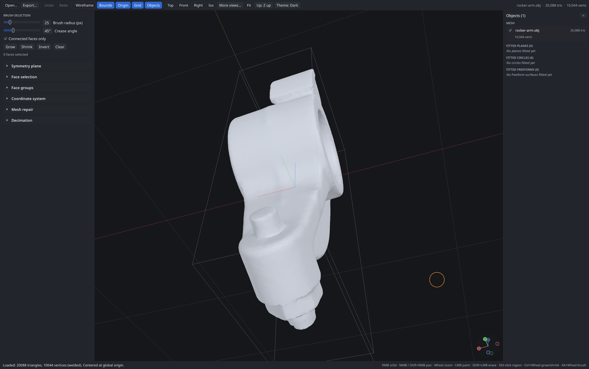
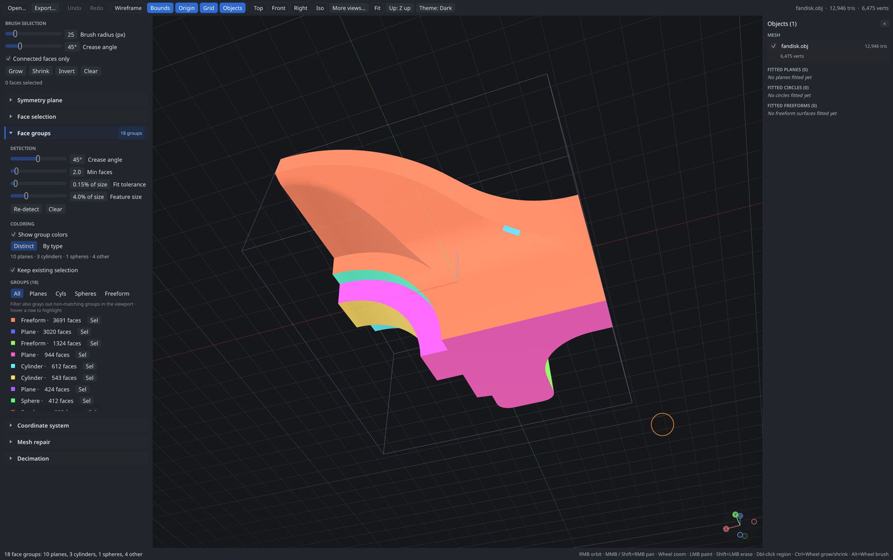
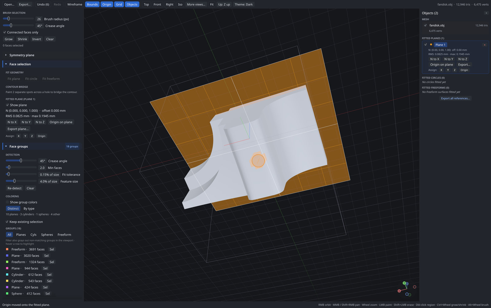
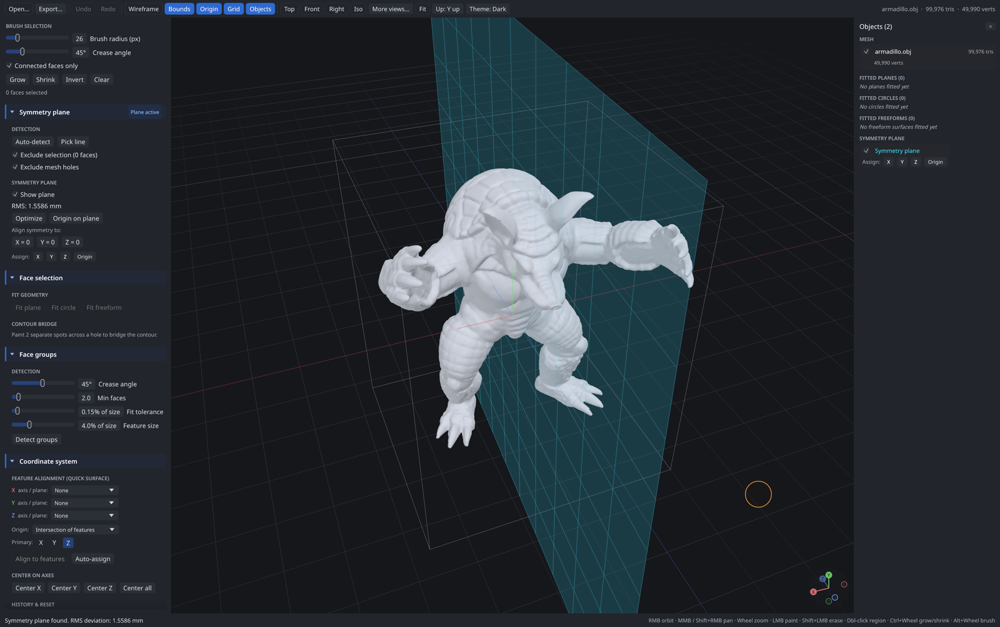
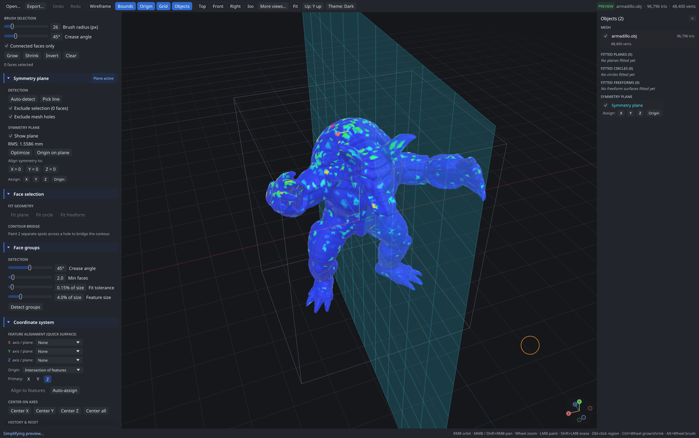
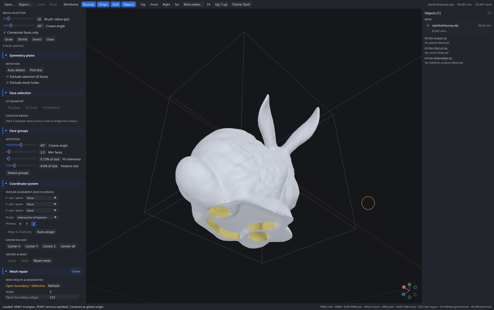
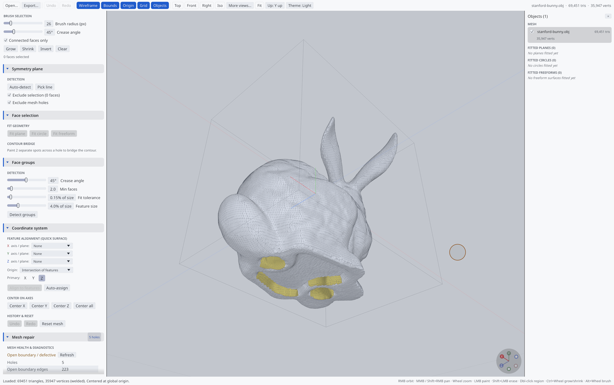

# ScanImprover

> **Note:** This project is 100% **Vibe Coding** — created iteratively and experimentally with AI assistance, but it works exceptionally well for my daily workflow!

**ScanImprover** is a lightweight, high-performance desktop application built in Rust for pre-processing 3D scan meshes (STL, OBJ, PLY) before importing them into CAD environments like **Autodesk Fusion 360**.

---

## 🎯 Purpose & Why ScanImprover?

When working with 3D scan data for reverse engineering in CAD software, two major bottlenecks frequently occur:

1. **Messy Coordinates & Orientation:**
   Scans rarely align cleanly to origin coordinate planes (XY, XZ, YZ). Manually nudging, rotating, and aligning a raw scan inside Fusion 360 or similar CAD packages can be frustrating, inaccurate, and tedious.
2. **Excessive Mesh Density & CAD Lag:**
   Raw scans often contain millions of polygons. CAD engines are optimized for boundary representation (B-Rep) solid modeling, not dense triangle soups. Heavy meshes cause viewport stutter, sluggish performance, high RAM usage, or even crashes.

**ScanImprover solves both problems fast:**
* **Perfect Alignment:** Fit geometric primitives (planes, cylinders, spheres) to selected scan features, align normal vectors to primary axes, and snap origins cleanly.
* **Smart Mesh Decimation:** Drastically reduce triangle count while preserving geometric silhouettes and surface details, ensuring smooth and responsive CAD performance.

---

## 📸 Feature Showcase



| **Automatic Face Groups & Primitive Classification** | **Plane Fitting & Alignment** |
| :---: | :---: |
|  |  |

| **Symmetry Plane Detection** | **Decimation with Deviation Heatmap** |
| :---: | :---: |
|  |  |

| **Mesh Repair (hole detection)** | **Light Theme** |
| :---: | :---: |
|  |  |

The screenshots use the example meshes from `examples/` (fandisk, rocker arm, Stanford bunny and armadillo; run `examples/fetch.sh` to download them, see `examples/README.md` for their origins). They are generated by the app itself: `cargo run -- --screenshots screenshots examples/fandisk.obj examples/stanford-bunny.obj examples/armadillo.obj examples/rocker-arm.obj`.

---

## ✨ Key Features

- **Blazing Fast Native Performance:** Built with Rust, the [Bevy](https://bevy.org) engine (wgpu based) for the 3D viewport, `egui` for the interface, and multi-threaded processing via `rayon`. Every long operation (loading, decimation, analysis, repair, segmentation, export) runs on worker threads with a live activity feed — the UI never blocks.
- **Light & Dark Themes:** WCAG AA conformant palettes with the Noto Sans interface font; panel sizes, theme and view settings are remembered between runs. The window renders only when something changes, so an idle app does not drain the battery.
- **Modern CAD Viewport:** 4x anti-aliased rendering, ground grid, navigation gizmo, turntable orbit camera that rotates around the point under the cursor, zoom-to-cursor, exact panning, animated view presets and a selectable up axis (Y or Z).
- **Mesh Decimation:** Fast, high-quality simplification (meshoptimizer) to bring multi-million triangle meshes down to lightweight CAD-friendly sizes, with measured deviation and a heatmap.
- **Interactive Primitive Fitting & Alignment:**
  - Plane fitting (least-squares)
  - Cylinder and sphere fitting, circle fitting as cylinder cross-sections
  - Coordinate system realignment (origin, X/Y/Z primary directions, 3-2-1 datum alignment from fitted features)
- **Automatic Face Groups:**
  - Scan-aware segmentation: smoothed normals, feature-size crease detection (fillets and small features separate surfaces, noise does not), live crease-angle preview
  - Automatic classification as plane / cylinder / sphere with fitted parameters
  - Distinct or by-type coloring to quickly find functional surfaces
- **Selection & Editing Tools:**
  - Connected brush selection (no bleeding through thin walls), region double-click, grow / shrink by crease angle
  - Non-destructive hiding of regions to reach geometry behind
  - Crop / cut / delete unwanted artifacts and noise
- **Mesh Repair:** Health diagnostics (holes, non-manifold edges and vertices, shells, degenerate faces), hole filling with several algorithms and edge-flip quality improvement, contour bridges, normal unification and debris removal.
- **Freeform Surfaces:** Moving-least-squares surface fitting with overshoot, exported as real B-spline STEP patches for CAD.
- **Format Support:** Fast parallel loading and exporting of STL, PLY and OBJ; reference geometry export as STEP, DXF or Fusion 360 script.

---

## 🚀 Quick Start

### Prerequisites
- [Rust toolchain](https://www.rust-lang.org/tools/install) (Edition 2024 / latest stable)
- A modern GPU supporting Vulkan, DirectX 12, or Metal

### Running the App

```bash
cargo run --release
```

You can also pass a mesh file on the command line or drag and drop one onto the window.

Windows batch scripts:
- `start.bat`: Runs the existing build
- `build_and_start.bat`: Builds the latest code in release mode and launches it

### Navigation & Shortcuts

| Input | Action |
| --- | --- |
| Right mouse drag | Orbit around the point under the cursor |
| Middle mouse drag / Shift + right drag | Pan |
| Mouse wheel | Zoom towards the cursor |
| Left mouse drag / Shift + drag | Paint / erase face selection |
| Double-click | Select the face group or crease-bounded region |
| Ctrl + wheel, `.` / `,` | Grow / shrink the selection |
| Alt + wheel | Brush size |
| `F` | Fit selection (or model) into view |
| `1` `2` `3` `4` | X / Y / Z / iso views |
| `G` | Toggle the ground grid |
| `H` | Hide the selected faces |
| Ctrl + `O`, Ctrl + `Z`, Ctrl + `Y` | Open, undo, redo |

Click an axis on the navigation gizmo (bottom right of the viewport) to look along it; click it again to look from the opposite side.

---

## 🛠️ Recommended Reverse Engineering Workflow (with Fusion 360)

1. **Import Scan:** Open your raw `.stl`, `.ply` or `.obj` scan in ScanImprover.
2. **Clean Noise:** Trim away excess scan noise, table planes, or scanning artifacts.
3. **Decimate:** Reduce polygon density to a manageable size (e.g. 50k–250k triangles depending on detail).
4. **Align Coordinate System:**
   - Fit a plane to the bottom/reference surface -> set as Z=0 (or XY plane).
   - Fit a cylinder or secondary plane -> align along X or Y axis.
   - Set the origin (0, 0, 0) to a functional reference datum.
5. **Export:** Export the cleaned and aligned mesh.
6. **CAD Reverse Engineering:** Insert the optimized mesh directly into Fusion 360. Sketches and reference geometry will automatically line up with Fusion's default origin planes without any viewport lag.

---

## 🧱 Code Layout

| Path | Contents |
| --- | --- |
| `src/app/` | Application state split by concern: history, session (loading / transforms / jobs), features, selection, repair, tasks (worker-backed operations), viewport |
| `src/camera.rs` | Turntable orbit camera with animated transitions |
| `src/render/` | Bevy scene: mesh entities with crease-split normals, overlay line / fill meshes, gizmos, camera and lights synced from the app state |
| `src/geom/` | Geometry algorithms: SAH BVH, fitting, segmentation, symmetry, freeform, holes, repair, bridges |
| `src/io/`, `src/export/` | Mesh readers / writers and CAD reference exports |
| `src/ui/` | egui panels (via `bevy_egui`), theme, toolbar, status bar, object browser |
| `src/worker.rs` | Worker thread pool with progress reporting |

Run the tests with `cargo test`. `cargo run -- model.stl --screenshot out.png` renders a few frames, saves the window to `out.png` and exits (used for automated visual checks). A list of all fixes and improvements of the 2026 refactoring pass is in `CHANGES.md`.

### Demo video

```bash
cargo run -- --demo demo.mp4 part.stl scan.obj large.stl
```

records a scripted tour of the features (`src/demo.rs`) in fullscreen at 30 fps and encodes it with `ffmpeg` (must be on the `PATH`). The three meshes are a CAD-like part (face groups, plane fit, alignment, symmetry), a scan with holes (repair) and a dense mesh (decimation); an optional fourth mesh is used for the overview shots. `--screenshots <dir>` with the same arguments saves the README stills instead. Mouse and keyboard are ignored while a script runs.

---

## 📄 License

This project is licensed under the MIT License.
