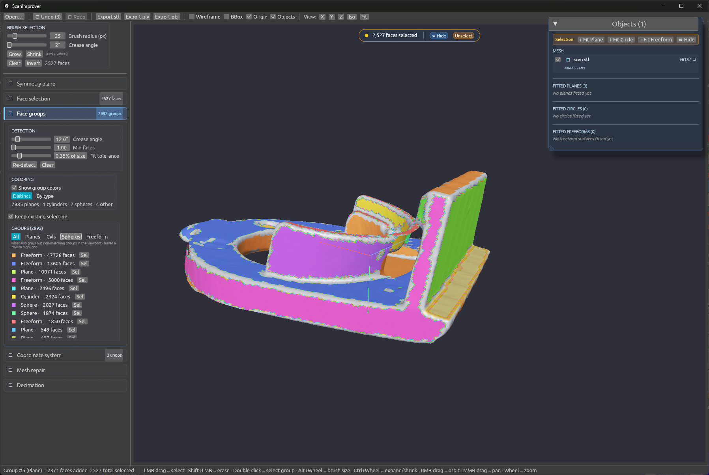
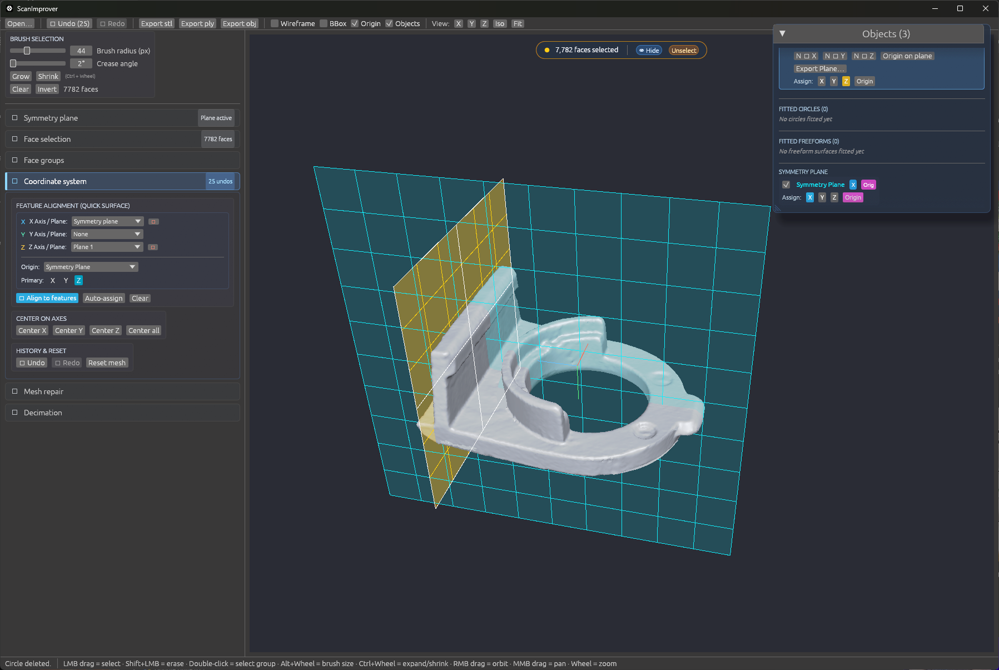
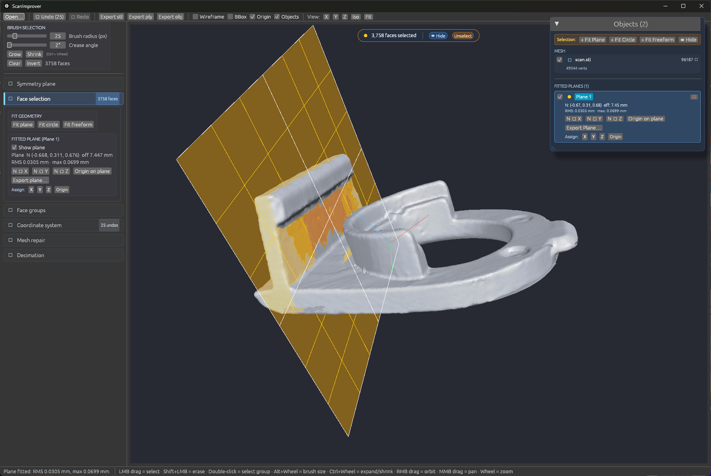
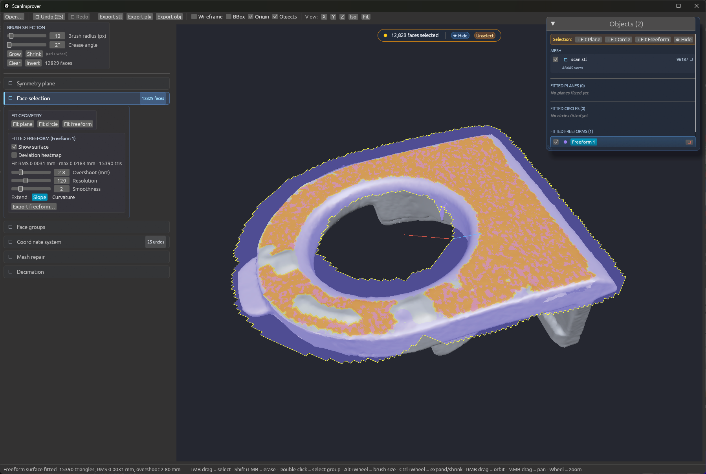
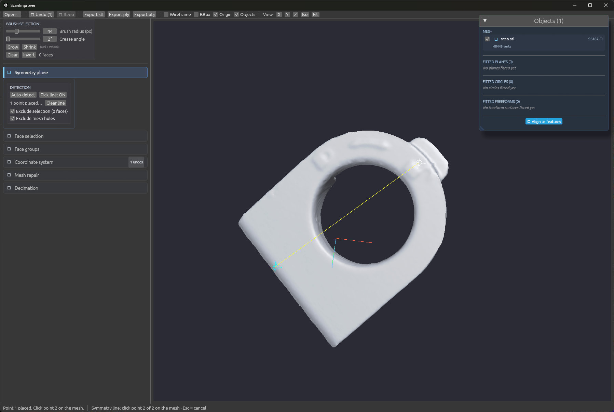
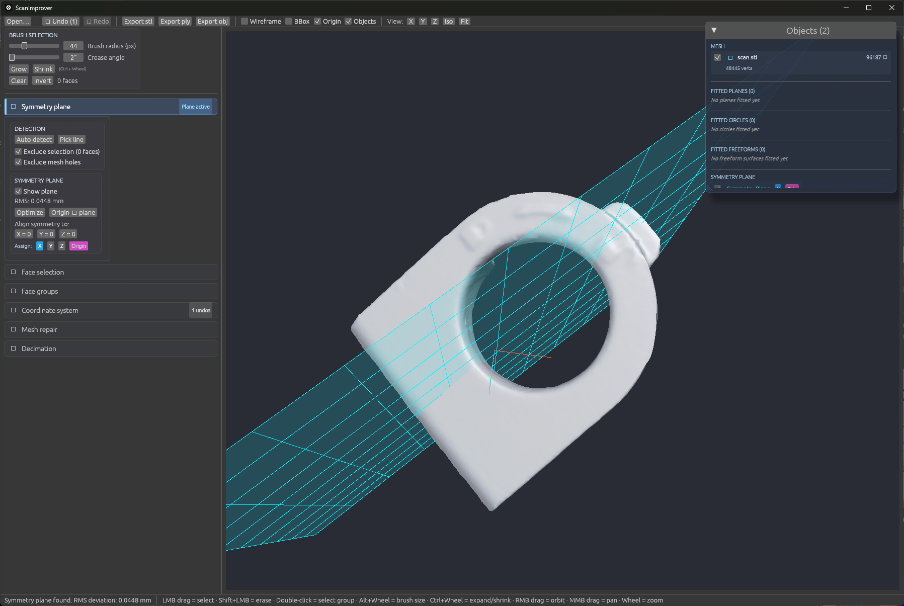

# ScanImprover

> **Note:** This project is 100% **Vibe Coding** — created iteratively and experimentally with AI assistance, but it works exceptionally well for my daily workflow!

**ScanImprover** is a lightweight, high-performance desktop application built in Rust for pre-processing 3D scan meshes (STL, OBJ, etc.) before importing them into CAD environments like **Autodesk Fusion 360**.

---

## 🎯 Purpose & Why ScanImprover?

When working with 3D scan data for reverse engineering in CAD software, two major bottlenecks frequently occur:

1. **Messy Coordinates & Orientation:**
   Scans rarely align cleanly to origin coordinate planes (XY, XZ, YZ). Manually nudging, rotating, and aligning a raw scan inside Fusion 360 or similar CAD packages can be frustrating, inaccurate, and tedious.
2. **Excessive Mesh Density & CAD Lag:**
   Raw scans often contain millions of polygons. CAD engines are optimized for boundary representation (B-Rep) solid modeling, not dense triangle soups. Heavy meshes cause viewport stutter, sluggish performance, high RAM usage, or even crashes.

**ScanImprover solves both problems fast:**
* **Perfect Alignment:** Fit geometric primitives (planes, cylinders, spheres) to selected scan features, align normal vectors to primary axes, and snap origins cleanly.
* **Smart Mesh Decimation:** Drastically reduce triangle count while preserving geometric silhouettes and surface details, ensuring smooth and responsive CAD performance.

---

## 📸 Feature Showcase

| **Automatic Face Groups & Primitive Classification** | **Alignment & Coordinate System Snapping** |
| :---: | :---: |
|  |  |

| **Interactive Plane Creation & Fitting** | **Freeform Surface Fitting** |
| :---: | :---: |
|  |  |

### Symmetry Plane Detection
| Before Detection | After Detection & Mirroring |
| :---: | :---: |
|  |  |

---

## ✨ Key Features

- **Blazing Fast Native Performance:** Built with Rust, `wgpu`, and multi-threaded processing via `rayon`.
- **Mesh Decimation:** Fast, high-quality simplification to bring multi-million triangle meshes down to lightweight CAD-friendly sizes.
- **Interactive Primitive Fitting & Alignment:**
  - Plane fitting (RANSAC / least-squares)
  - Cylinder and sphere fitting
  - Coordinate system realignment (Origin, X/Y/Z primary directions)
- **Automatic Face Groups:**
  - Region-growing segmentation with live crease-angle preview
  - Automatic classification as plane / cylinder / sphere with fitted parameters
  - Distinct or by-type coloring to quickly find functional surfaces
- **Selection & Editing Tools:**
  - Brush selection, point picking, and connected component filtering
  - Crop / cut / delete unwanted artifacts and noise
- **Format Support:** Fast loading and exporting for common 3D mesh formats (e.g. STL, OBJ).
- **Clean & Modern UI:** Rendered with `egui` and hardware-accelerated with WebGPU (`wgpu`).

---

## 🚀 Quick Start

### Prerequisites
- [Rust toolchain](https://www.rust-lang.org/tools/install) (Edition 2024 / latest stable)
- A modern GPU supporting Vulkan, DirectX 12, or Metal

### Running the App

You can quickly run the app using Cargo:

```bash
cargo run --release
```

Or using the included batch scripts on Windows:
- `start.bat`: Runs the existing build
- `build_and_start.bat`: Builds the latest code in release mode and launches it

---

## 🛠️ Recommended Reverse Engineering Workflow (with Fusion 360)

1. **Import Scan:** Open your raw `.stl` or `.obj` scan in ScanImprover.
2. **Clean Noise:** Trim away excess scan noise, table planes, or scanning artifacts.
3. **Decimate:** Reduce polygon density to a manageable size (e.g. 50k–250k triangles depending on detail).
4. **Align Coordinate System:**
   - Fit a plane to the bottom/reference surface -> set as Z=0 (or XY plane).
   - Fit a cylinder or secondary plane -> align along X or Y axis.
   - Set the origin (0, 0, 0) to a functional reference datum.
5. **Export:** Export the cleaned and aligned mesh.
6. **CAD Reverse Engineering:** Insert the optimized mesh directly into Fusion 360. Sketches and reference geometry will automatically line up with Fusion's default origin planes without any viewport lag.

---

## 📄 License

This project is licensed under the MIT License.